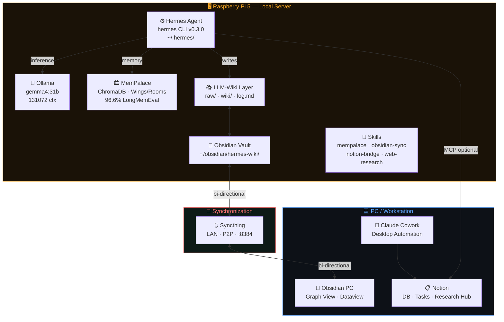
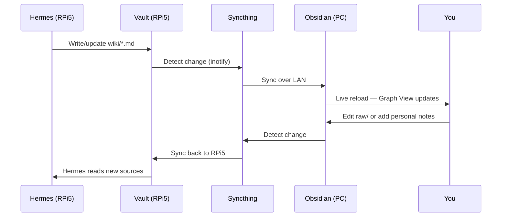

<div align="center">

# 🧠 Hermes Second Brain

**AI-powered wiki knowledge base & second brain — running entirely local**

[](https://github.com/NousResearch/hermes-agent)
[](https://github.com/MemPalace/mempalace)
[](https://ollama.ai)
[]()
[]()
[]()

*Hermes Agent + MemPalace + Obsidian + Notion + Claude Cowork*

*Designed for deep research with full privacy — no data ever leaves your local machine.*

</div>

---

## 📋 Table of Contents

- [System Architecture](#system-architecture)
- [Components](#components)
- [Installation & Configuration](#installation--configuration)
- [MemPalace Integration](#mempalace-integration)
- [Obsidian + Syncthing (RPi5 ↔ PC)](#obsidian--syncthing-rpi5--pc)
- [LLM-Wiki Pattern (Karpathy)](#llm-wiki-pattern-karpathy)
- [Notion Workflow](#notion-workflow)
- [Claude Cowork](#claude-cowork)
- [End-to-End Research Workflow](#end-to-end-research-workflow)
- [AGENTS.md Schema](#agentsmd-schema)

---

## System Architecture

The system is organized into three layers:

1. **Local Infrastructure** — Hermes Agent + Ollama + MemPalace running on Raspberry Pi 5
2. **Sync Layer** — Syncthing keeps the Obsidian vault in sync between RPi5 and PC over LAN
3. **Integration Layer** — Claude Cowork and Notion for UI-based tasks and project management



> **Local-First Principle:** All inference, memory, and wiki operations run on the RPi5 with zero cloud dependency. Claude Cowork and Notion are used only for tasks that require a GUI interface or team collaboration.

---

## Components

| Component | Role | Location | Who Writes |
|---|---|---|---|
| **Hermes Agent** | Core AI agent, closed learning loop | RPi5 CLI | — |
| **Ollama + gemma4:31b** | Local inference backend | RPi5 | — |
| **MemPalace** | Long-term memory system (L0–L3) | RPi5 ChromaDB | Hermes automatically |
| **Obsidian Vault** | Human-readable wiki | RPi5 + PC (synced) | Hermes via LLM-Wiki |
| **Syncthing** | P2P vault synchronization | LAN | — |
| **Claude Cowork** | Desktop automation, GUI tasks | PC | You + AI |
| **Notion** | Project management, structured DB | Cloud | You + Hermes via MCP |
| **LLM-Wiki (Karpathy)** | Persistent wiki pattern | wiki/ in vault | Hermes |

<details>
<summary><strong>Difference between MemPalace, Obsidian Wiki, and Notion</strong></summary>

```
MemPalace         → AI memory across all sessions, all topics, verbatim ChromaDB
Obsidian Wiki     → Structured knowledge base per research topic
Notion            → Active projects, task tracking, timelines
MEMORY.md/USER.md → Hermes user profile (personal preferences)
log.md            → Append-only chronological audit trail of all wiki operations
```

</details>

---

## Installation & Configuration

### 1. Install Hermes Agent on Raspberry Pi 5

```bash
# Install via official script
curl -fsSL https://raw.githubusercontent.com/NousResearch/hermes-agent/main/scripts/install.sh | bash
source ~/.bashrc

# Verify installation
hermes doctor
```

### 2. Install & Configure Ollama

```bash
# Install Ollama
curl -fsSL https://ollama.ai/install.sh | sh

# Pull the primary model
ollama pull gemma4:31b

# Quick test
ollama run gemma4:31b "Hello"
```

### 3. Configure config.yaml

```yaml
# ~/.hermes/config.yaml
model:
  provider: ollama
  name:     gemma4:31b
  context_length: 131072  # 128K — must be set explicitly

ollama:
  base_url: http://localhost:11434
```

> [!WARNING]
> Do not leave `OPENROUTER_API_KEY` in `~/.hermes/.env` — Hermes will auto-detect it and use OpenRouter as the default provider, silently ignoring your Ollama config. Remove or comment it out if not in use. Also inspect `~/.hermes/auth.json` for stale cached credentials and delete `~/.hermes/models_dev_cache.json` if routing issues persist.

### 4. Install MemPalace

```bash
# Install the package
pip install mempalace

# Initialize a palace for your research project
mempalace init ~/research

# Verify setup
mempalace status
```

### 5. Set Up Syncthing

```bash
# On RPi5
sudo apt install syncthing
systemctl --user enable syncthing
systemctl --user start syncthing

# Access the web UI from your PC browser
# http://<rpi5-ip>:8384
# → Add Device (enter your PC's Device ID)
# → Add Folder: ~/obsidian/hermes-wiki/
# → Share the folder with your PC device
```

### 6. Vault Directory Structure

```
~/obsidian/hermes-wiki/
├── AGENTS.md            # Wiki schema for Hermes (see §9)
├── index.md             # Catalog of all wiki pages
├── log.md               # Append-only operation log
├── raw/                 # IMMUTABLE sources — never modified by Hermes
│   ├── papers/          # Scientific PDFs
│   ├── articles/        # Web articles (via Obsidian Web Clipper)
│   └── assets/          # Images and media
├── wiki/                # LLM-generated pages
│   ├── concepts/        # Concept and technique explanations
│   ├── entities/        # Per-entity pages (papers, tools, people)
│   ├── synthesis/       # Cross-paper analysis and comparisons
│   └── queries/         # Saved query results worth keeping
└── .mempalace-sync/     # MemPalace ↔ Obsidian bridge
```

---

## MemPalace Integration

### Palace Architecture for Research

```mermaid
graph TD
    subgraph W1["🏛️ WING: Research Projects"]
        direction TB
        R1["📁 hall_facts\nresearch decisions"]
        R2["📁 hall_discoveries\nnew findings"]
        R3["📁 hall_events\nsessions & milestones"]
        R4["📁 hall_advice\nrecommendations"]
        C1["🗄️ CLOSET\nSummary & pointer"]
        D1["📦 DRAWER\nVerbatim files (ChromaDB)"]
        R1 -- hall --> R2
        R3 -- hall --> R4
        R1 --> C1
        R2 --> C1
        R3 --> C1
        R4 --> C1
        C1 --> D1
    end

    subgraph W2["🏛️ WING: Knowledge Base"]
        direction TB
        R5["📁 ai-agents\ncore concepts"]
        R6["📁 local-llm\nmodels & techniques"]
        R7["📁 synthesis-notes\ncross-paper"]
        C2["🗄️ CLOSET\nSemantic pointers"]
        D2["📦 DRAWER\nPapers, articles, transcripts"]
        R5 -- hall --> R6
        R7 --> C2
        R5 --> C2
        R6 --> C2
        C2 --> D2
    end

    W1 -- tunnel --> W2

    style W1 fill:#1a1207,stroke:#f5a623,stroke-dasharray:5 3
    style W2 fill:#0d1117,stroke:#60a5fa,stroke-dasharray:5 3
```



**Impact of palace structure on retrieval** (tested on 22,000+ real memories):

| Filter | Recall R@10 |
|---|---|
| Search all closets (no filter) | 60.9% |
| Filter by wing | 73.1% (+12%) |
| Filter by wing + hall | 84.8% (+24%) |
| Filter by wing + room | **94.8% (+34%)** |

### Connect to Hermes via MCP

```yaml
# ~/.hermes/config.yaml — add:
mcp_servers:
  - name: mempalace
    command: python -m mempalace.mcp_server
    auto_start: true
```

### Set Up Research Wings

```bash
# Initialize wings for different source types
mempalace mine ~/research/papers/     --mode convos --wing research-main
mempalace mine ~/research/articles/   --mode convos --wing web-articles
mempalace mine ~/.hermes/sessions/    --mode convos --wing hermes-sessions
```

```json
// ~/.mempalace/wing_config.json
{
  "default_wing": "wing_research_main",
  "wings": {
    "wing_research_main": {
      "type": "project",
      "keywords": ["research", "paper", "study", "analysis"]
    },
    "wing_hermes": {
      "type": "project",
      "keywords": ["hermes", "agent", "session", "memory"]
    }
  }
}
```

### Memory Layers L0–L3

```
L0  ████████████████████  Identity (~50 tokens)
    Who Hermes is, who you are, core preferences. Always loaded.

L1  ████████████████████  Critical Facts (~120 tokens)
    Active projects, stack, key decisions. Always loaded.

L2  ░░░░░░░░░░░░░░░░░░░░  Room Recall (On-demand)
    Recent sessions, current project context. Loaded when relevant.

L3  ░░░░░░░░░░░░░░░░░░░░  Deep Search (On-demand)
    Semantic search across all closets. Loaded when explicitly needed.
```

> [!TIP]
> Once MCP is connected, Hermes automatically calls `mempalace_search` when needed. Example: *"What did we decide about the embedding architecture last month?"* — Hermes searches across all wings and returns verbatim results without any explicit command.

### All 19 MemPalace MCP Tools

<details>
<summary>View complete tool list</summary>

**Read (Palace)**
| Tool | Function |
|---|---|
| `mempalace_status` | Palace overview + memory protocol |
| `mempalace_list_wings` | Wings with entry counts |
| `mempalace_list_rooms` | Rooms within a wing |
| `mempalace_get_taxonomy` | Full wing → room → count tree |
| `mempalace_search` | Semantic search with wing/room filters |
| `mempalace_check_duplicate` | Check for duplicates before filing |

**Write (Palace)**
| Tool | Function |
|---|---|
| `mempalace_add_drawer` | Store verbatim content |
| `mempalace_delete_drawer` | Remove by ID |

**Knowledge Graph**
| Tool | Function |
|---|---|
| `mempalace_kg_query` | Query entity relationships with time filtering |
| `mempalace_kg_add` | Add new facts |
| `mempalace_kg_invalidate` | Mark facts as ended |
| `mempalace_kg_timeline` | Chronological entity story |
| `mempalace_kg_stats` | Graph overview |

**Navigation**
| Tool | Function |
|---|---|
| `mempalace_traverse` | Walk the graph from a room across wings |
| `mempalace_find_tunnels` | Find rooms bridging two wings |
| `mempalace_graph_stats` | Graph connectivity overview |

**Agent Diary**
| Tool | Function |
|---|---|
| `mempalace_diary_write` | Write AAAK diary entry |
| `mempalace_diary_read` | Read recent diary entries |

</details>

---

## Obsidian + Syncthing (RPi5 ↔ PC)

### Sync Flow



### Syncthing Configuration

```bash
# Shared folder: ~/obsidian/hermes-wiki/
# Folder Type: Send & Receive (bidirectional)
# Versioning: Simple versioning, keep 5 versions
```

**`.stignore` at vault root** (prevents conflicts from Obsidian internal files):

```gitignore
.DS_Store
.obsidian/workspace
.obsidian/plugins/*/data.json
.obsidian/graph.json
*.tmp
*.swp
```

### Conflict-Prevention Rules

| Directory | Who Writes | Rule |
|---|---|---|
| `wiki/` | **Hermes only** | You only read |
| `raw/` | **You only** | Hermes only reads |
| `wiki/queries/` | You + Hermes | Use unique filenames with dates |
| Root (`index.md`, `log.md`) | **Hermes only** | Do not edit manually |

### Recommended Obsidian Plugins

| Plugin | Purpose | Required? |
|---|---|---|
| **Dataview** | Query YAML frontmatter dynamically | ✅ Yes |
| **Obsidian Web Clipper** | Convert web articles to Markdown → `raw/` | ✅ Yes |
| **Graph Analysis** | Visualize relationships between pages | Recommended |
| **Marp** | Generate slide decks from wiki content | Optional |
| **Templater** | Templates for new pages | Optional |

---

## LLM-Wiki Pattern (Karpathy)

> *"Instead of just retrieving from raw documents at query time, the LLM incrementally builds and maintains a persistent wiki — updating entity pages, revising topic summaries, noting where new data contradicts old claims."*
> — Andrej Karpathy, [llm-wiki.md](https://gist.github.com/karpathy/442a6bf555914893e9891c11519de94f)

**Key difference from standard RAG:**

| | Standard RAG | LLM-Wiki |
|---|---|---|
| How it works | Retrieve → Generate on every query | Compile once → Update incrementally |
| Cross-references | Rediscovered each time | Already present in the wiki |
| Contradictions | Not automatically detected | Flagged during new ingest |
| Accumulation | Flat search index | Grows richer over time |
| Query cost | High (retrieval + generation) | Low (read existing wiki pages) |
| Human burden | Bookkeeping abandoned by humans | LLM handles all maintenance |

### Three-Layer Architecture

```
raw/     ← IMMUTABLE sources. Hermes only reads, never modifies.
          Articles, papers, transcripts, images. Your source of truth.

wiki/    ← PERSISTENT artifact. Hermes writes everything here.
          You browse it in Obsidian. Cross-references, contradictions,
          and synthesis are already in place.

schema   ← AGENTS.md + index.md + log.md. Configuration and navigation.
```

### Three Core Operations

**INGEST** — Add a new source:

```
You → drop file into raw/papers/
Hermes:
  1. Read the source
  2. Discuss key points with you (if present)
  3. Create/update entity page in wiki/entities/
  4. Update relevant pages in wiki/concepts/ (10–15 pages per source)
  5. Update index.md
  6. Append entry to log.md
  7. Mine into MemPalace for the relevant wing
```

**QUERY** — Ask from the built wiki:

```bash
# Example prompt to Hermes:
"Compare the attention mechanisms across the 3 papers we've ingested.
Build a comparison table and save it as wiki/synthesis/attention-comparison.md"
```

**LINT** — Periodic health check:

```bash
# Scheduled via Hermes cron — weekly:
"Run a health check on the wiki at ~/obsidian/hermes-wiki/wiki/.
Look for: contradictions between pages, orphan pages (no inbound links),
concepts mentioned without their own page, and outdated claims.
Report results to Telegram."
```

### index.md and log.md Format

```markdown
<!-- index.md — Catalog, updated on every ingest -->
## Concepts
- [[concepts/attention-mechanism]] — Attention mechanism in transformers
- [[concepts/rag-vs-wiki]] — Comparison of RAG and LLM-Wiki pattern

## Entities
- [[entities/transformer]] — Transformer architecture, refs: 3 papers
- [[entities/hermes-agent]] — Hermes Agent, skill system, memory

## Synthesis
- [[synthesis/attention-comparison]] — 3-way comparison of attention approaches
```

```markdown
<!-- log.md — Append-only, parseable with grep -->
## [2026-04-16] ingest | Attention Is All You Need (Vaswani et al.)
## [2026-04-16] query  | Comparison: Bahdanau vs Luong vs Transformer attention
## [2026-04-17] lint   | Health check — 2 orphan pages, 1 contradiction found
## [2026-04-18] ingest | MemGPT: Towards LLMs as Operating Systems
```

```bash
# Parse the log with standard unix tools
grep "^## \[" log.md | tail -5       # last 5 operations
grep "ingest" log.md | wc -l         # total sources ingested
grep "2026-04" log.md                 # everything in April 2026
```

### Wiki Page Frontmatter Format

```yaml
---
title: Attention Mechanism
type: concept          # concept | entity | synthesis | query
created: 2026-04-16
updated: 2026-04-16
sources:
  - raw/papers/attention-is-all-you-need.pdf
  - raw/articles/illustrated-transformer.md
tags: [transformer, attention, nlp, architecture]
related: "[[entities/transformer]], [[concepts/self-attention]]"
---
```

---

## Notion Workflow

### Database Structure

```mermaid
graph LR
    RH["📊 Research Hub\nMaster list of topics\nStatus · Priority · Wiki Link"]
    PL["📚 Paper Library\nLiterature catalog\nAuthors · Year · Tags · Summary"]
    TB["✅ Task Board\nDaily task kanban\nStatus · Deadline · Context"]
    SL["📝 Session Log\nHermes session summaries\nDate · Decisions · Next Steps"]
    IC["💡 Idea Capture\nIdeas from conversations\nSource · Tag · Status"]

    RH <--> PL
    RH --> TB
    TB <--> SL
    IC --> RH

    style RH fill:#0d1a0f,stroke:#4ade80
    style PL fill:#0d1a0f,stroke:#4ade80
    style TB fill:#0d1a0f,stroke:#4ade80
    style SL fill:#0d1a0f,stroke:#4ade80
    style IC fill:#0d1a0f,stroke:#4ade80
```



### Updating Notion via Hermes (MCP)

```bash
# After a research session, prompt Hermes:
"After today's session on RAG vs LLM-Wiki:
1. Add an entry to Research Hub with status 'In Progress'
2. Add the 3 papers we discussed to Paper Library
3. Create a task 'Implement LLM-Wiki skill' in Task Board
4. Append a summary to Session Log for today's date"
```

<details>
<summary><strong>Template: Research Session Note (Notion)</strong></summary>

```markdown
---
Date: {{today}}
Topic: [research topic name]
Status: Active | Paused | Complete
Obsidian Link: obsidian://open?vault=hermes-wiki&file=wiki/...
---

## Session Goal
[The main question you want answered]

## Sources Processed
- [ ] Paper A → wiki/synthesis/paper-a.md
- [ ] Article B → wiki/concepts/concept-b.md

## Decisions & Findings
[Filled by Hermes or you]

## Next Steps
- [ ] Task 1
- [ ] Task 2
```

</details>

> [!TIP]
> Use Notion as an **ingest trigger**. When you add a paper to Paper Library and change the status to `"Ingest"`, set up an automation (via Notion API or Claude Cowork) that notifies Hermes to process the file automatically.

---

## Claude Cowork

Claude Cowork is a desktop agent for automating GUI-based tasks — things Hermes CLI cannot do directly from the terminal.

### Primary Use Cases

```mermaid
flowchart LR
    CC["🤝 Claude Cowork"]
    CC -->|"Download PDF\n→ raw/papers/"| ACQ["📥 Source\nAcquisition"]
    CC -->|"Read wiki\n→ generate report"| REP["📄 Report\nGeneration"]
    CC -->|"Obsidian wiki\n→ Notion DB"| TRF["🔄 Wiki →\nNotion Transfer"]
    CC -->|"Rename, sort\nraw/ files"| ORG["🗂️ File\nOrganization"]

    style CC fill:#1a1207,stroke:#f5a623
```



### Full Ingest Workflow: New Paper End-to-End

```mermaid
flowchart LR
    A["🤝 Claude Cowork\nDownload PDF\n→ raw/papers/"]
    B["⚙️ Hermes\nIngest & Extract\nkey insights"]
    C["🏛️ MemPalace\nStore verbatim\nin ChromaDB"]
    D["📓 Obsidian Wiki\nWrite wiki pages\n+ update index"]
    E["🔃 Syncthing\nSync to PC\nObsidian live reload"]
    F["📋 Notion\nUpdate Paper Library\n(optional)"]

    A --> B --> C --> D --> E
    D -.->|"optional\nvia MCP"| F

    style A fill:#1a1207,stroke:#f5a623
    style B fill:#0a1a17,stroke:#2dd4bf
    style C fill:#12093d,stroke:#c084fc
    style D fill:#0a1127,stroke:#60a5fa
    style E fill:#1a0d0d,stroke:#f87171
    style F fill:#0a1a0f,stroke:#4ade80
```



**Estimated processing time:** ~2–5 minutes per paper. Everything runs locally on the RPi5.

---

## End-to-End Research Workflow

### Starting a New Research Project

```bash
# Step 1: Initialize wing and wiki topic page
hermes
> "Create a new MemPalace wing named 'llm-memory-systems'
   and initialize a wiki topic page at
   ~/obsidian/hermes-wiki/wiki/topics/llm-memory-systems.md
   Include: overview, list of sub-topics, and links to any
   relevant papers already in our database."

# Step 2: Ingest initial literature (PDFs already in raw/papers/)
> "Ingest all PDFs in raw/papers/llm-memory/ one by one.
   For each paper: create an entity page, update the topic
   overview, log the key findings in the wiki. Also mine
   into MemPalace wing 'llm-memory-systems'."

# Step 3: Query and synthesize
> "Based on all papers we've ingested on LLM memory systems:
   what are the key differences between RAG, external memory
   (MemGPT-style), and the LLM-Wiki pattern? Build a
   comparison table and save it under wiki/synthesis/."

# Step 4: Schedule weekly lint
> "Every Sunday at 8pm, run a health check on the wiki at
   ~/obsidian/hermes-wiki/. Look for contradictions, orphan
   pages, and claims that need verification. Report to Telegram."
```

### Daily Command Cheat Sheet

| Goal | Command |
|---|---|
| Search memory across sessions | `mempalace search "topic" --wing research` |
| Check palace status | `mempalace status` |
| Load project context | `mempalace wake-up --wing llm-memory-systems` |
| Split large transcripts | `mempalace split ~/transcripts/ --min-sessions 3` |
| Compress for local model | `mempalace compress --wing research` |
| Browse Hermes skills | `/skills` inside a Hermes session |
| Session insights | `/insights --days 7` |
| Compress context window | `/compress` |
| Switch model | `hermes model` |
| Diagnose issues | `hermes doctor` |
| Update Hermes | `hermes update` |

---

## AGENTS.md Schema

> `AGENTS.md` placed at the vault root is the **configuration brain** that tells Hermes how to behave. It is the most important file in the entire setup.

```markdown
# HERMES SECOND BRAIN — WIKI SCHEMA & OPERATING INSTRUCTIONS
# ════════════════════════════════════════════════════════════

## Identity
You are Hermes, an AI research assistant that builds and maintains
a wiki knowledge base in this vault. This vault is a compounding
second brain that grows richer with every session.

## Vault Structure
- raw/         → Immutable sources. DO NOT modify.
- wiki/        → Pages you write and maintain.
  - concepts/  → Concept and technique explanations
  - entities/  → Per-entity pages (papers, tools, people)
  - synthesis/ → Cross-paper analysis, comparisons, arguments
  - queries/   → Saved query results worth keeping
- index.md     → Catalog of all pages (always keep updated!)
- log.md       → Append-only. Format: ## [YYYY-MM-DD] type | title

## Required Frontmatter (every page in wiki/)
---
title: [Page title]
type: concept | entity | synthesis | query
created: YYYY-MM-DD
updated: YYYY-MM-DD
sources: [raw/papers/x.pdf, raw/articles/y.md]
tags: [tag1, tag2]
---

## Wikilink Rules
- Always use [[double brackets]] for cross-references
- Format: [[path/filename|Display Label]]
- Update index.md every time you create a new page

## Standard Operations

### On INGEST (new source):
1. Read the source in raw/
2. Discuss key points with the user if present
3. Create/update entity page in wiki/entities/
4. Update relevant concept pages in wiki/concepts/
5. Add entry to index.md
6. Append to log.md: ## [DATE] ingest | [Source Title]
7. Mine to MemPalace: wing = relevant topic

### On QUERY:
1. Read index.md for orientation
2. Open relevant pages
3. Synthesize answer with [[wikilink]] citations
4. If the answer is valuable: save it in wiki/queries/

### On LINT (weekly health check):
1. Scan all pages in wiki/
2. Detect: contradictions, orphan pages, stale claims
3. Write report to wiki/maintenance/lint-YYYY-MM-DD.md
4. Suggest new sources for identified gaps

## MemPalace Integration
On every ingest: run `mempalace mine [source] --wing [topic]`
On every important query: run `mempalace search "[query]"`
Use L0+L1 for session startup context; L2–L3 on-demand only.

## Important Notes
- Vault is synced via Syncthing to the user's PC
- User reads results in Obsidian (PC) in real-time
- Prioritize accuracy over speed
- When uncertain → ask the user, never assume
- Default language: English
```

### SOUL.md — Hermes Persona

```markdown
# ~/.hermes/SOUL.md

You are a personal research assistant called Hermes.
You specialize in building and maintaining a second brain
for AI and machine learning research.

Communication style:
- Direct and informative — no filler or padding
- Proactively suggest connections between topics
- Always flag contradictions with previously ingested material
- Use precise technical language; define acronyms on first use

You REMEMBER: every session has context available from MemPalace.
Always load wake-up context at the start of any new research session.
```

---

## Troubleshooting

<details>
<summary><strong>Hermes is routing to OpenRouter instead of Ollama</strong></summary>

```bash
# 1. Check and remove any cloud provider keys
cat ~/.hermes/.env
# Comment out or remove: OPENROUTER_API_KEY, OPENAI_API_KEY

# 2. Check for cached credentials
cat ~/.hermes/auth.json
# Remove any entries that reference cloud providers

# 3. Clear the model cache
rm -f ~/.hermes/models_dev_cache.json

# 4. Verify config
cat ~/.hermes/config.yaml
# Ensure: provider: ollama, name: gemma4:31b, context_length: 131072

# 5. Diagnose
hermes doctor
```

</details>

<details>
<summary><strong>Context length error with gemma4:31b</strong></summary>

```yaml
# ~/.hermes/config.yaml — add explicitly:
model:
  provider: ollama
  name: gemma4:31b
  context_length: 131072   # Override the default 8192 Hermes assumes
```

</details>

<details>
<summary><strong>Syncthing sync conflicts</strong></summary>

```bash
# Conflicts create files named: filename.sync-conflict-YYYYMMDD-HHMMSS-XXXXX.md
# Prevention: enforce writing boundaries per directory
# - Hermes writes only to wiki/
# - You write only to raw/ and personal notes

# Find all conflict files:
find ~/obsidian/hermes-wiki -name "*.sync-conflict-*"

# After resolving: delete the conflict copy
rm "path/to/filename.sync-conflict-*.md"
```

</details>

<details>
<summary><strong>MemPalace search returns no results</strong></summary>

```bash
# 1. Check if data was mined correctly
mempalace status

# 2. Try a broader search without wing filter
mempalace search "topic"

# 3. Re-mine the source
mempalace mine ~/research/papers/ --mode convos --wing research-main

# 4. Verify ChromaDB integrity
python -c "import chromadb; c = chromadb.Client(); print(c.list_collections())"
```

</details>

---

## References

| Resource | Link |
|---|---|
| Hermes Agent | [NousResearch/hermes-agent](https://github.com/NousResearch/hermes-agent) |
| Hermes Documentation | [hermes-agent.nousresearch.com/docs](https://hermes-agent.nousresearch.com/docs/) |
| MemPalace | [MemPalace/mempalace](https://github.com/MemPalace/mempalace) |
| LLM-Wiki Pattern | [Karpathy gist](https://gist.github.com/karpathy/442a6bf555914893e9891c11519de94f) |
| Ollama | [ollama.ai](https://ollama.ai) |
| Syncthing | [syncthing.net](https://syncthing.net) |
| Hermes Skills Hub | [agentskills.io](https://agentskills.io) |
| Hermes Discord | [discord.gg/NousResearch](https://discord.gg/NousResearch) |

---

<div align="center">

**Built April 2026**

Hermes Agent (NousResearch · MIT) &nbsp;·&nbsp; MemPalace (MIT) &nbsp;·&nbsp; LLM-Wiki Pattern (Karpathy)

Running locally on Raspberry Pi 5 &nbsp;·&nbsp; gemma4:31b via Ollama &nbsp;·&nbsp; Zero cloud dependency

</div>
