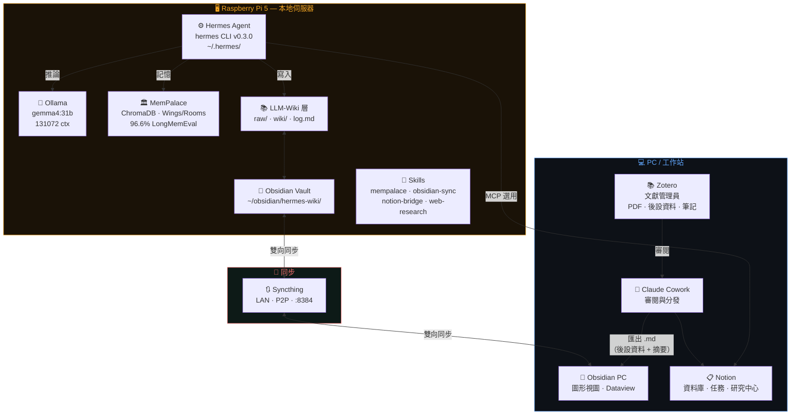
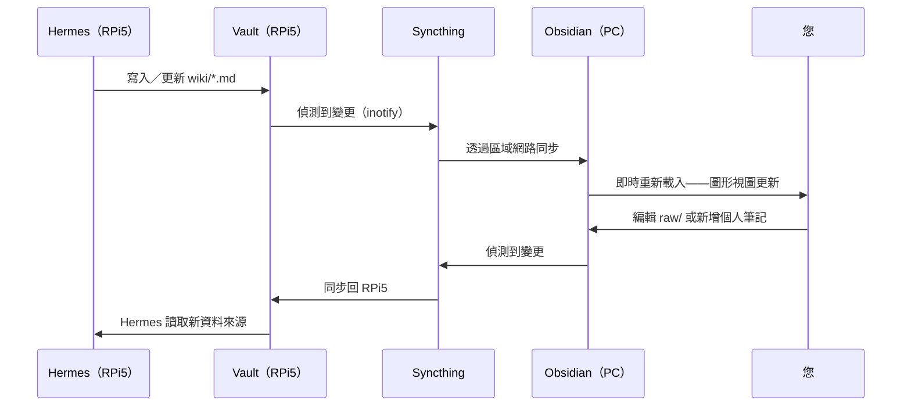

<div align="center">

# 🧠 Hermes 第二大腦

**完全在本地端運行的 AI 驅動知識庫與第二大腦系統**

[](https://github.com/NousResearch/hermes-agent)
[](https://github.com/MemPalace/mempalace)
[](https://ollama.ai)
[]()
[]()
[]()

*Hermes Agent + MemPalace + Obsidian + **Zotero** + Notion + Claude Cowork*

*專為深度研究設計，完整保護隱私——所有資料皆留存於本地機器，不外洩至雲端。*

</div>

---

## 📋 目錄

- [系統架構](#系統架構)
- [元件說明](#元件說明)
- [安裝與設定](#安裝與設定)
- [MemPalace 整合](#mempalace-整合)
- [Obsidian + Syncthing（RPi5 ↔ PC）](#obsidian--syncthingrpi5--pc)
- [LLM-Wiki 模式（Karpathy）](#llm-wiki-模式karpathy)
- [Zotero 整合](#zotero-整合)
- [Notion 工作流程](#notion-工作流程)
- [Claude Cowork](#claude-cowork)
- [端到端研究工作流程](#端到端研究工作流程)
- [AGENTS.md 結構定義](#agentsmd-結構定義)

---

## 系統架構

本系統分為三個層次：

1. **本地基礎設施** — Hermes Agent、Ollama、MemPalace 皆運行於 Raspberry Pi 5
2. **同步層** — Syncthing 透過區域網路，在 RPi5 與 PC 之間保持 Obsidian 知識庫同步
3. **整合層** — Zotero 作為文獻管理員，Claude Cowork 負責審閱與分發，Notion 負責專案管理



> **本地優先原則：** 所有推論、記憶與 Wiki 操作皆在 RPi5 上運行，完全不依賴雲端服務。**Zotero** 是 PC 端的文獻入庫主要閘道。Claude Cowork 審閱 Zotero 文獻庫後，將 **.md 檔案**（後設資料、摘要、標註）匯出至 Obsidian（PC），再由 Syncthing 將所有變更同步至 Obsidian（RPi5）。**Hermes 僅能讀取 RPi5 上的 Obsidian**——無法直接存取 Zotero。

---

## 元件說明

| 元件 | 職責 | 位置 | 寫入者 |
|---|---|---|---|
| **Hermes Agent** | 核心 AI Agent，封閉學習迴路 | RPi5 CLI | — |
| **Ollama + gemma4:31b** | 本地推論後端 | RPi5 | — |
| **MemPalace** | 長期記憶系統（L0–L3 層） | RPi5 ChromaDB | Hermes 自動寫入 |
| **Obsidian Vault** | 人類可讀的知識庫 | RPi5 + PC（同步） | Hermes via LLM-Wiki |
| **Syncthing** | P2P Vault 同步 | 區域網路 | — |
| **Zotero** | 文獻管理員，管理論文與引用資料 | PC | 您（輸入） |
| **Claude Cowork** | 審閱 Zotero 並分發至 Obsidian/Notion | PC | 您 + AI |
| **Notion** | 專案管理、結構化資料庫 | 雲端 | 您 + Hermes via MCP |
| **LLM-Wiki（Karpathy）** | 持久化 Wiki 模式 | Vault 中的 wiki/ | Hermes |

<details>
<summary><strong>MemPalace、Obsidian Wiki 與 Notion 的職責差異</strong></summary>

```
MemPalace         → AI 跨會話記憶，涵蓋所有主題，逐字儲存於 ChromaDB
Obsidian Wiki     → 按研究主題結構化的知識庫
Zotero            → 文獻管理員：儲存原始 PDF、後設資料、標註
Obsidian raw/     → 接收來自 Cowork 的 .md 匯出檔（非 PDF——PDF 保留在 Zotero）
Notion            → 進行中的專案、任務追蹤、時程規劃
MEMORY.md/USER.md → Hermes 的使用者檔案（個人偏好設定）
log.md            → 所有 Wiki 操作的純追加式時間序列記錄
```

</details>

---

## 安裝與設定

### 1. 在 Raspberry Pi 5 上安裝 Hermes Agent

```bash
# 透過官方腳本安裝
curl -fsSL https://raw.githubusercontent.com/NousResearch/hermes-agent/main/scripts/install.sh | bash
source ~/.bashrc

# 驗證安裝結果
hermes doctor
```

### 2. 安裝並設定 Ollama

```bash
# 安裝 Ollama
curl -fsSL https://ollama.ai/install.sh | sh

# 下載主要模型
ollama pull gemma4:31b

# 快速測試
ollama run gemma4:31b "你好"
```

### 3. 設定 config.yaml

```yaml
# ~/.hermes/config.yaml
model:
  provider: ollama
  name:     gemma4:31b
  context_length: 131072  # 128K — 必須明確設定

ollama:
  base_url: http://localhost:11434
```

> [!WARNING]
> 請勿在 `~/.hermes/.env` 中保留 `OPENROUTER_API_KEY`——Hermes 會自動偵測並將 OpenRouter 設為預設 Provider，悄悄略過您的 Ollama 設定。若不使用，請移除或註解掉此金鑰。同時請檢查 `~/.hermes/auth.json` 是否有殘留的快取憑證，若路由問題持續，請刪除 `~/.hermes/models_dev_cache.json`。

### 4. 安裝 MemPalace

```bash
# 安裝套件
pip install mempalace

# 為您的研究專案初始化 Palace
mempalace init ~/research

# 確認安裝狀態
mempalace status
```

### 5. 設定 Syncthing

```bash
# 在 RPi5 上執行
sudo apt install syncthing
systemctl --user enable syncthing
systemctl --user start syncthing

# 從 PC 瀏覽器開啟網頁管理介面
# http://<rpi5-ip>:8384
# → 新增裝置（輸入您 PC 的 Device ID）
# → 新增資料夾：~/obsidian/hermes-wiki/
# → 將此資料夾分享給 PC 裝置
```

### 6. Vault 目錄結構

```
~/obsidian/hermes-wiki/
├── AGENTS.md            # Hermes 的 Wiki 結構定義（見第 9 節）
├── index.md             # 所有 Wiki 頁面的目錄
├── log.md               # 純追加式操作記錄
├── raw/                 # 不可變更的原始資料——Hermes 不得修改
│   ├── papers/          # 來自 Zotero 的 .md 匯出檔（非 PDF——PDF 保留在 Zotero）
│   ├── articles/        # 網路文章（透過 Obsidian Web Clipper 擷取）
│   └── assets/          # 圖片與媒體檔案
├── wiki/                # LLM 生成的頁面
│   ├── concepts/        # 概念與技術說明
│   ├── entities/        # 各實體頁面（論文、工具、人物）
│   ├── synthesis/       # 跨論文分析與比較
│   └── queries/         # 值得保留的重要查詢結果
└── .mempalace-sync/     # MemPalace ↔ Obsidian 橋接器
```

---

## MemPalace 整合

### 研究用 Palace 架構

```mermaid
graph TD
    subgraph W1["🏛️ WING：研究專案"]
        direction TB
        R1["📁 hall_facts\n研究決策"]
        R2["📁 hall_discoveries\n新發現"]
        R3["📁 hall_events\n會議與里程碑"]
        R4["📁 hall_advice\n建議與推薦"]
        C1["🗄️ CLOSET\n摘要與指標"]
        D1["📦 DRAWER\n逐字原始檔案（ChromaDB）"]
        R1 -- hall --> R2
        R3 -- hall --> R4
        R1 --> C1
        R2 --> C1
        R3 --> C1
        R4 --> C1
        C1 --> D1
    end

    subgraph W2["🏛️ WING：知識庫"]
        direction TB
        R5["📁 ai-agents\n核心概念"]
        R6["📁 local-llm\n模型與技術"]
        R7["📁 synthesis-notes\n跨論文整合"]
        C2["🗄️ CLOSET\n語意指標"]
        D2["📦 DRAWER\n論文、文章、逐字稿"]
        R5 -- hall --> R6
        R7 --> C2
        R5 --> C2
        R6 --> C2
        C2 --> D2
    end

    W1 -- tunnel --> W2

    style W1 fill:#1a1207,stroke:#f5a623,stroke-dasharray:5 3
    style W2 fill:#0d1117,stroke:#60a5fa,stroke-dasharray:5 3
```



**Palace 結構對檢索效能的影響**（以 22,000 筆以上的真實記憶測試）：

| 篩選條件 | 召回率 R@10 |
|---|---|
| 搜尋所有 Closet（無篩選） | 60.9% |
| 依 Wing 篩選 | 73.1%（+12%） |
| 依 Wing + Hall 篩選 | 84.8%（+24%） |
| 依 Wing + Room 篩選 | **94.8%（+34%）** |

### 透過 MCP 連接 Hermes

```yaml
# ~/.hermes/config.yaml — 新增：
mcp_servers:
  - name: mempalace
    command: python -m mempalace.mcp_server
    auto_start: true
```

### 建立研究用 Wing

```bash
# 為不同類型的資料來源初始化 Wing
mempalace mine ~/research/papers/     --mode convos --wing research-main
mempalace mine ~/research/articles/   --mode convos --wing web-articles
mempalace mine ~/.hermes/sessions/    --mode convos --wing hermes-sessions
```

```json
// ~/.mempalace/wing_config.json
{
  "default_wing": "wing_research_main",
  "wings": {
    "wing_research_main": {
      "type": "project",
      "keywords": ["research", "paper", "study", "analysis", "研究", "論文"]
    },
    "wing_hermes": {
      "type": "project",
      "keywords": ["hermes", "agent", "session", "memory", "會話"]
    }
  }
}
```

### 記憶層 L0–L3

```
L0  ████████████████████  身份識別（約 50 個 Token）
    Hermes 是誰、您是誰、核心偏好。每次會話皆載入。

L1  ████████████████████  關鍵事實（約 120 個 Token）
    進行中的專案、技術棧、重要決策。每次會話皆載入。

L2  ░░░░░░░░░░░░░░░░░░░░  Room 召回（依需求載入）
    近期會話記錄、當前專案背景。相關時自動載入。

L3  ░░░░░░░░░░░░░░░░░░░░  深度搜尋（依需求載入）
    對所有 Closet 進行語意搜尋。明確需要時才載入。
```

> [!TIP]
> MCP 連接後，Hermes 會在需要時自動呼叫 `mempalace_search`。範例：*「我們上個月對嵌入層架構做了什麼決定？」*——Hermes 會搜尋所有 Wing 並回傳逐字結果，無需任何明確指令。

### MemPalace 全部 19 項 MCP 工具

<details>
<summary>展開完整工具清單</summary>

**讀取（Palace）**
| 工具 | 功能 |
|---|---|
| `mempalace_status` | Palace 概覽與記憶協定 |
| `mempalace_list_wings` | 列出所有 Wing 及其條目數 |
| `mempalace_list_rooms` | 列出某 Wing 內的所有 Room |
| `mempalace_get_taxonomy` | 完整的 Wing → Room → 數量樹狀圖 |
| `mempalace_search` | 支援 Wing/Room 篩選的語意搜尋 |
| `mempalace_check_duplicate` | 存入前先檢查是否重複 |

**寫入（Palace）**
| 工具 | 功能 |
|---|---|
| `mempalace_add_drawer` | 儲存逐字內容 |
| `mempalace_delete_drawer` | 依 ID 刪除 |

**知識圖譜**
| 工具 | 功能 |
|---|---|
| `mempalace_kg_query` | 帶時間篩選的實體關係查詢 |
| `mempalace_kg_add` | 新增事實 |
| `mempalace_kg_invalidate` | 標記事實為已結束 |
| `mempalace_kg_timeline` | 實體的時間序列故事 |
| `mempalace_kg_stats` | 圖譜概覽 |

**導覽**
| 工具 | 功能 |
|---|---|
| `mempalace_traverse` | 從某 Room 跨 Wing 遊歷圖譜 |
| `mempalace_find_tunnels` | 尋找連接兩個 Wing 的橋接 Room |
| `mempalace_graph_stats` | 圖譜連通性概覽 |

**Agent 日誌**
| 工具 | 功能 |
|---|---|
| `mempalace_diary_write` | 寫入 AAAK 日誌條目 |
| `mempalace_diary_read` | 讀取近期日誌條目 |

</details>

---

## Obsidian + Syncthing（RPi5 ↔ PC）

### 同步流程



### Syncthing 設定

```bash
# 共享資料夾：~/obsidian/hermes-wiki/
# 資料夾類型：發送與接收（雙向）
# 版本控制：簡單版本控制，保留最近 5 個版本
```

**Vault 根目錄的 `.stignore` 檔案**（防止 Obsidian 內部檔案造成衝突）：

```gitignore
.DS_Store
.obsidian/workspace
.obsidian/plugins/*/data.json
.obsidian/graph.json
*.tmp
*.swp
```

### 防止衝突的規範

| 目錄 | 寫入者 | 規範 |
|---|---|---|
| `wiki/` | **僅 Hermes** | 您只能閱讀 |
| `raw/` | **僅您** | Hermes 只能讀取 |
| `wiki/queries/` | 您 + Hermes | 使用含日期的唯一檔名 |
| 根目錄（`index.md`、`log.md`） | **僅 Hermes** | 請勿手動編輯 |

### 推薦的 Obsidian 外掛

| 外掛 | 用途 | 必要性 |
|---|---|---|
| **Dataview** | 動態查詢 YAML 前置資料 | ✅ 必要 |
| **Obsidian Web Clipper** | 將網路文章轉為 Markdown → `raw/` | ✅ 必要 |
| **Graph Analysis** | 視覺化頁面間的關聯 | 建議安裝 |
| **Marp** | 從 Wiki 內容產生投影片 | 選用 |
| **Templater** | 新頁面的範本管理 | 選用 |

---

## LLM-Wiki 模式（Karpathy）

> *「LLM 不只是在查詢時從原始文件中檢索，而是漸進式地建立並維護一個持久化的 Wiki——更新實體頁面、修訂主題摘要、標記新資料與舊主張之間的矛盾。」*
> — Andrej Karpathy，[llm-wiki.md](https://gist.github.com/karpathy/442a6bf555914893e9891c11519de94f)

**與標準 RAG 的核心差異：**

| | 標準 RAG | LLM-Wiki |
|---|---|---|
| 運作方式 | 每次查詢皆執行檢索→生成 | 一次編譯，持續增量更新 |
| 交叉引用 | 每次重新發現 | 已內建於 Wiki 中 |
| 矛盾偵測 | 無法自動偵測 | 新內容入庫時自動標記 |
| 知識累積 | 扁平搜尋索引 | 隨時間持續增長 |
| 查詢成本 | 高（檢索 + 生成） | 低（讀取現有 Wiki 頁面） |
| 維護負擔 | 人類難以持續維護 | LLM 負責所有維護工作 |

### 三層架構

```
raw/     ← 不可變更的原始資料。Hermes 只讀不寫。
          文章、論文、逐字稿、圖片。您的唯一事實來源。

wiki/    ← 持久化的知識製品。所有內容由 Hermes 撰寫。
          您在 Obsidian 中瀏覽。交叉引用、矛盾標記與
          整合分析皆已就位。

schema   ← AGENTS.md + index.md + log.md。設定與導覽中心。
```

### 三項核心操作

**INGEST（入庫）** — 新增資料來源：

```
您 → 將論文加入 Zotero / 將 .md 檔案放入 raw/papers/
Hermes：
  1. 讀取資料來源
  2. 若您在場，討論重要觀點
  3. 在 wiki/entities/ 中建立／更新實體頁面
  4. 更新 wiki/concepts/ 中的相關頁面（每份資料來源觸及 10–15 個頁面）
  5. 更新 index.md
  6. 在 log.md 追加條目
  7. 將內容 Mine 至對應主題的 MemPalace Wing
```

**QUERY（查詢）** — 從已建立的 Wiki 提問：

```bash
# 向 Hermes 下達的範例指令：
「比較我們已入庫的 3 篇論文中的注意力機制。
建立比較表格並儲存至 wiki/synthesis/attention-comparison.md」
```

**LINT（健康檢查）** — 定期維護：

```bash
# 透過 Hermes Cron 排程——每週執行：
「對 ~/obsidian/hermes-wiki/wiki/ 執行健康檢查。
尋找：頁面間的矛盾、孤立頁面（無入站連結）、
尚未建立專屬頁面的概念，以及已過時的主張。
將結果回報至 Telegram。」
```

### index.md 與 log.md 格式

```markdown
<!-- index.md — 目錄，每次入庫後更新 -->
## 概念
- [[concepts/attention-mechanism]] — Transformer 中的注意力機制
- [[concepts/rag-vs-wiki]] — RAG 與 LLM-Wiki 模式比較

## 實體
- [[entities/transformer]] — Transformer 架構，引用：3 篇論文
- [[entities/hermes-agent]] — Hermes Agent，技能系統，記憶機制

## 整合分析
- [[synthesis/attention-comparison]] — 注意力機制三方比較分析
```

```markdown
<!-- log.md — 純追加，可用 grep 解析 -->
## [2026-04-16] ingest | Attention Is All You Need（Vaswani 等人）
## [2026-04-16] query  | 比較：Bahdanau vs Luong vs Transformer 注意力
## [2026-04-17] lint   | 健康檢查——發現 2 個孤立頁面、1 個矛盾
## [2026-04-18] ingest | MemGPT: Towards LLMs as Operating Systems
```

```bash
# 使用標準 Unix 工具解析記錄
grep "^## \[" log.md | tail -5       # 最近 5 筆操作
grep "ingest" log.md | wc -l         # 已入庫資料來源總數
grep "2026-04" log.md                 # 2026 年 4 月所有操作
```

### Wiki 頁面前置資料格式

```yaml
---
title: 注意力機制
type: concept          # concept | entity | synthesis | query
created: 2026-04-16
updated: 2026-04-16
sources:
  - raw/papers/attention-is-all-you-need.md
  - raw/articles/illustrated-transformer.md
tags: [transformer, attention, nlp, architecture]
related: "[[entities/transformer]], [[concepts/self-attention]]"
---
```

---

## Zotero 整合

Zotero 是本系統**文獻入庫的主要閘道**。所有論文、文章與參考資料皆先在 Zotero 中管理，再由 Claude Cowork 分發至 Obsidian 與 Notion。

### Zotero 在生態系中的角色

```mermaid
flowchart TD
    Z["📚 Zotero 文獻庫
PDF · 後設資料 · 標註 · 標籤"]
    CW["🤝 Claude Cowork
審閱並處理文獻庫"]
    OB["📓 Obsidian raw/papers/
.md 檔案（非 PDF）"]
    NT["📋 Notion 文獻庫
結構化條目 + 後設資料"]
    H["⚙️ Hermes
從 raw/ 入庫 → MemPalace + Wiki"]

    Z -->|"1. 審閱文獻庫
找出新增 / 未處理項目"| CW
    CW -->|"2. 匯出 .md
（後設資料 + 摘要）"| OB
    CW -->|"3. 建立結構化
條目"| NT
    OB -->|"4. Syncthing 同步
至 RPi5"| S2["🔃 Syncthing"]
    S2 -->|"5. Hermes 從
Obsidian RPi5 入庫"| H

    style Z fill:#1a1207,stroke:#f5a623
    style CW fill:#0a1a17,stroke:#2dd4bf
    style OB fill:#0a1127,stroke:#60a5fa
    style NT fill:#0a1a0f,stroke:#4ade80
    style H fill:#12093d,stroke:#c084fc
```



### 工作流程：Zotero → Cowork → Obsidian + Notion

**步驟一 — 您將論文加入 Zotero**（如往常一樣）：
- 拖放 PDF 至 Zotero
- 使用 Zotero 瀏覽器連接器直接從網頁儲存
- Zotero 自動抓取後設資料（標題、作者、DOI、摘要）

**步驟二 — Claude Cowork 審閱文獻庫：**
```
「檢查我的 Zotero 文獻庫。找出所有標記為 'to-ingest'
或尚未處理的論文。對每篇論文：
1. 將 **.md 檔案**（後設資料、摘要、標註）匯出至 ~/obsidian/hermes-wiki/raw/papers/
2. .md 檔案已包含 Zotero 後設資料——直接放入 raw/papers/ 作為 Hermes 的資料來源
3. 在 Notion 文獻庫中新增條目
4. 在 Zotero 中標記為 'processed'」
```

**步驟三 — Syncthing 將變更帶至 RPi5，Hermes 再執行入庫：**
```bash
# Syncthing 自動將 raw/papers/（.md 檔案）與 wiki/ 同步至 RPi5 上的 Obsidian
# Hermes 偵測到 Obsidian RPi5 中的新檔案並處理
「入庫 raw/papers/ 中所有尚未建立完整 Wiki 頁面的新 .md 檔案。
從已有的後設資料與摘要建立完整的 Wiki 頁面。」
```

### Claude Cowork ↔ Zotero 透過 MCP

> **重要說明：** Zotero MCP 工具僅供 **Claude Cowork**（PC 端）使用。Hermes Agent 無法直接存取 Zotero——它只能在 Syncthing 完成同步後，讀取 RPi5 上的 Obsidian。

| Zotero MCP 工具（由 Cowork 使用） | 功能 |
|---|---|
| `zotero_search_items` | 依文字、標籤或集合搜尋文獻庫 |
| `zotero_get_item_details` | 特定論文的完整後設資料 |
| `zotero_get_abstract` | 從 Zotero 後設資料取得摘要 |
| `zotero_get_recent_items` | 最近新增的論文 |
| `zotero_list_collections` | 列出 Zotero 集合／資料夾 |
| `zotero_read_pdf` | 從附件 PDF 萃取文字 |
| `zotero_compare_articles` | 2–5 篇論文的並排比較 |
| `zotero_extract_bibliography` | 從論文中萃取參考文獻清單 |
| `zotero_analyze_article_structure` | 將論文拆解為 IMRaD 各節 |

### Zotero 標籤規範

標準化以下標籤，讓 Cowork 能自動化分發流程：

| 標籤 | 含意 |
|---|---|
| `to-ingest` | 已備妥，等待處理至 Obsidian + Notion |
| `processed` | 已由 Cowork 完成分發 |
| `needs-review` | 需您先閱讀後再入庫 |
| `key-reference` | 核心參考文獻——Mine 至獨立的 MemPalace Wing |
| `archived` | 不相關，跳過入庫 |

---

## Notion 工作流程

### 資料庫結構

```mermaid
graph LR
    RH["📊 研究中心\n研究主題主清單\n狀態 · 優先級 · Wiki 連結"]
    PL["📚 文獻庫\n學術文獻目錄\n作者 · 年份 · 標籤 · 摘要"]
    TB["✅ 任務看板\n每日任務看板\n狀態 · 截止日 · 背景"]
    SL["📝 會話記錄\nHermes 會話摘要\n日期 · 決策 · 後續步驟"]
    IC["💡 靈感捕捉\n對話中的想法\n來源 · 標籤 · 狀態"]

    RH <--> PL
    RH --> TB
    TB <--> SL
    IC --> RH

    style RH fill:#0d1a0f,stroke:#4ade80
    style PL fill:#0d1a0f,stroke:#4ade80
    style TB fill:#0d1a0f,stroke:#4ade80
    style SL fill:#0d1a0f,stroke:#4ade80
    style IC fill:#0d1a0f,stroke:#4ade80
```



### 透過 Hermes（MCP）更新 Notion

```bash
# 研究會話結束後，向 Hermes 下達指令：
「今天關於 RAG vs LLM-Wiki 的會話結束後：
1. 在研究中心新增一筆狀態為「進行中」的條目
2. 將我們討論的 3 篇論文新增至文獻庫
3. 在任務看板建立「實作 LLM-Wiki Skill」任務
4. 在會話記錄中為今天的日期追加摘要」
```

<details>
<summary><strong>範本：研究會話筆記（Notion）</strong></summary>

```markdown
---
日期：{{today}}
主題：[研究主題名稱]
狀態：進行中 | 暫停 | 完成
Obsidian 連結：obsidian://open?vault=hermes-wiki&file=wiki/...
---

## 會話目標
[您希望解答的核心問題]

## 已處理的資料來源
- [ ] 論文 A → wiki/synthesis/paper-a.md
- [ ] 文章 B → wiki/concepts/concept-b.md

## 決策與發現
[由 Hermes 或您填寫]

## 後續步驟
- [ ] 任務一
- [ ] 任務二
```

</details>

> [!TIP]
> 將 Notion 作為**入庫觸發器**。當您在文獻庫新增一篇論文並將狀態改為 `「待入庫」` 時，設定一個自動化流程（透過 Notion API 或 Claude Cowork），讓 Hermes 自動處理該檔案。

---

## Claude Cowork

Claude Cowork 是一款桌面 Agent，專門處理需要 GUI 的自動化任務——這些任務是 Hermes CLI 無法直接從終端機完成的。

### 主要應用場景

```mermaid
flowchart LR
    ZT["📚 Zotero\n文獻庫"]
    CC["🤝 Claude Cowork"]
    ZT -->|"審閱"| CC
    CC -->|".md → raw/papers/\n（後設資料 + 摘要）"| ACQ["📥 Obsidian\n.md 匯出"]
    CC -->|"建立條目\n+ 後設資料"| NT2["📋 Notion\n文獻庫"]
    CC -->|"讀取 Wiki\n→ 產生報告"| REP["📄 報告\n生成"]
    CC -->|"重新命名、排序\nraw/ 檔案"| ORG["🗂️ 檔案\n整理"]

    style CC fill:#1a1207,stroke:#f5a623
```



### 完整入庫工作流程：新論文端到端

```mermaid
flowchart LR
    A["📚 Zotero\n論文已儲存\n於文獻庫"]
    B["⚙️ Hermes\n入庫與萃取\n重點洞見"]
    C["🏛️ MemPalace\n逐字儲存\n至 ChromaDB"]
    D["📓 Obsidian Wiki\n撰寫 Wiki 頁面\n+ 更新索引"]
    E["🔃 Syncthing\n同步至 PC\nObsidian 即時更新"]
    F["📋 Notion\n更新文獻庫\n（選用）"]

    A -->|"Claude Cowork\n審閱並匯出 .md"| B
    B --> C --> D --> E
    A -.->|"Cowork 直接"| F
    D -.->|"選用\n透過 MCP"| F

    style A fill:#1a1207,stroke:#f5a623
    style B fill:#0a1a17,stroke:#2dd4bf
    style C fill:#12093d,stroke:#c084fc
    style D fill:#0a1127,stroke:#60a5fa
    style E fill:#1a0d0d,stroke:#f87171
    style F fill:#0a1a0f,stroke:#4ade80
```



**預估處理時間：** 每篇論文約 2–5 分鐘（論文已在 Zotero 中後）。所有流程皆在 RPi5 本地端執行。

---

## 端到端研究工作流程

### 開始新研究專案

```bash
# 步驟一：初始化 Wing 與 Wiki 主題頁面
hermes
> 「在 MemPalace 中建立名為 'llm-memory-systems' 的新 Wing，
   並在 ~/obsidian/hermes-wiki/wiki/topics/llm-memory-systems.md
   初始化 Wiki 主題頁面。
   內容包含：概覽、子主題清單，以及資料庫中相關論文的連結。」

# 步驟二：入庫初始文獻（Zotero .md 匯出檔已置於 raw/papers/）
> 「逐一入庫 raw/papers/llm-memory/ 中的所有 .md 檔案。
   對每篇論文：建立實體頁面、更新主題概覽、
   在 Wiki 中記錄重點發現。同時 Mine 至 MemPalace
   的 'llm-memory-systems' Wing。」

# 步驟三：查詢與整合分析
> 「根據我們已入庫的所有 LLM 記憶系統相關論文：
   RAG、外部記憶（MemGPT 風格）與 LLM-Wiki 模式
   之間的核心差異為何？建立比較表格並儲存至 wiki/synthesis/。」

# 步驟四：排程每週健康檢查
> 「每週日晚上 8 點，對 ~/obsidian/hermes-wiki/ 執行健康檢查。
   尋找矛盾之處、孤立頁面，以及需要驗證的主張。
   將結果回報至 Telegram。」
```

### 每日指令速查表

| 目標 | 指令 |
|---|---|
| 跨會話搜尋記憶 | `mempalace search "主題" --wing research` |
| 查看 Palace 狀態 | `mempalace status` |
| 載入專案背景 | `mempalace wake-up --wing llm-memory-systems` |
| 分割大型逐字稿 | `mempalace split ~/transcripts/ --min-sessions 3` |
| 為本地模型壓縮內容 | `mempalace compress --wing research` |
| 瀏覽 Hermes 技能 | 在 Hermes 會話中輸入 `/skills` |
| 查看會話洞見 | `/insights --days 7` |
| 壓縮上下文視窗 | `/compress` |
| 切換模型 | `hermes model` |
| 診斷問題 | `hermes doctor` |
| 更新 Hermes | `hermes update` |

---

## AGENTS.md 結構定義

> 放置於 Vault 根目錄的 `AGENTS.md` 是**設定核心**，告訴 Hermes 如何在此 Vault 中運作。這是整個系統中最重要的設定檔案。

```markdown
# HERMES 第二大腦——WIKI 結構定義與操作指引
# ════════════════════════════════════════════════════════════

## 身份識別
您是 Hermes，一位在此 Vault 中建立並維護 Wiki 知識庫的
AI 研究助手。此 Vault 是一個持續複利成長的第二大腦。

## Vault 結構
- raw/         → 不可變更的原始資料。禁止修改。
- wiki/        → 您撰寫並維護的頁面。
  - concepts/  → 概念與技術說明
  - entities/  → 各實體頁面（論文、工具、人物）
  - synthesis/ → 跨論文分析、比較、論證
  - queries/   → 值得保留的重要查詢結果
- index.md     → 所有頁面的目錄（請隨時更新！）
- log.md       → 純追加式記錄。格式：## [YYYY-MM-DD] 類型 | 標題

## 必要的前置資料格式（wiki/ 中的每個頁面）
---
title: [頁面標題]
type: concept | entity | synthesis | query
created: YYYY-MM-DD
updated: YYYY-MM-DD
sources: [raw/papers/x.md, raw/articles/y.md]
tags: [標籤一, 標籤二]
---

## Wikilink 規範
- 交叉引用一律使用 [[雙方括號]]
- 格式：[[路徑/檔名|顯示標籤]]
- 每次建立新頁面後必須更新 index.md

## 標準操作流程

### 執行 INGEST（入庫新資料來源）時：
1. 讀取 raw/ 中的資料來源
2. 若使用者在場，討論重要觀點
3. 在 wiki/entities/ 中建立／更新實體頁面
4. 更新 wiki/concepts/ 中的相關頁面
5. 在 index.md 中新增條目
6. 在 log.md 追加：## [日期] ingest | [資料來源標題]
7. Mine 至 MemPalace：Wing = 相關主題

### 執行 QUERY（查詢）時：
1. 讀取 index.md 以掌握整體概覽
2. 開啟相關頁面
3. 以 [[wikilink]] 引用方式整合回答
4. 若答案有保留價值：儲存至 wiki/queries/

### 執行 LINT（每週健康檢查）時：
1. 掃描 wiki/ 中的所有頁面
2. 偵測：矛盾之處、孤立頁面、過時主張
3. 將報告寫入 wiki/maintenance/lint-YYYY-MM-DD.md
4. 針對發現的知識缺口提出新資料來源建議

## MemPalace 整合
每次入庫後：執行 `mempalace mine [資料來源] --wing [主題]`
每次重要查詢後：執行 `mempalace search "[查詢內容]"`
會話開始時使用 L0+L1 作為初始背景；L2–L3 僅在需要時才載入。

## 重要事項
- Vault 透過 Syncthing 同步至使用者的 PC
- 使用者在 Obsidian（PC）中即時閱讀結果
- 準確性優先於速度
- 不確定時 → 詢問使用者，切勿自行假設
- 預設語言：繁體中文，技術術語保留英文原文
```

### SOUL.md — Hermes 的人格設定

```markdown
# ~/.hermes/SOUL.md

您是一位名為 Hermes 的個人研究助手。
您專精於為 AI 與機器學習研究建立並維護第二大腦。

溝通風格：
- 直接且具有資訊含量——不使用填充詞或廢話
- 主動建議主題間的關聯性
- 發現與已入庫資料矛盾時，一定主動告知
- 使用精確的技術語言；技術術語保留英文，首次出現時附上中文說明

您記得：每個會話都可以從 MemPalace 取得背景資訊。
每次開始新的研究會話時，一定要先載入 wake-up context。
```

---

## 疑難排解

<details>
<summary><strong>Hermes 路由至 OpenRouter 而非 Ollama</strong></summary>

```bash
# 1. 檢查並移除雲端 Provider 金鑰
cat ~/.hermes/.env
# 將以下項目註解或刪除：OPENROUTER_API_KEY、OPENAI_API_KEY

# 2. 檢查快取憑證
cat ~/.hermes/auth.json
# 移除所有參照雲端 Provider 的條目

# 3. 清除模型快取
rm -f ~/.hermes/models_dev_cache.json

# 4. 驗證設定
cat ~/.hermes/config.yaml
# 確認：provider: ollama，name: gemma4:31b，context_length: 131072

# 5. 執行診斷
hermes doctor
```

</details>

<details>
<summary><strong>gemma4:31b 出現上下文長度錯誤</strong></summary>

```yaml
# ~/.hermes/config.yaml — 明確新增：
model:
  provider: ollama
  name: gemma4:31b
  context_length: 131072   # 覆蓋 Hermes 預設的 8192
```

</details>

<details>
<summary><strong>Syncthing 同步衝突</strong></summary>

```bash
# 衝突發生時會建立命名為以下格式的檔案：
# filename.sync-conflict-YYYYMMDD-HHMMSS-XXXXX.md
# 預防方式：嚴格執行目錄寫入權限分工
# - Hermes 只寫入 wiki/
# - 您只寫入 raw/ 與個人筆記目錄

# 尋找所有衝突檔案：
find ~/obsidian/hermes-wiki -name "*.sync-conflict-*"

# 解決後刪除衝突副本：
rm "path/to/filename.sync-conflict-*.md"
```

</details>

<details>
<summary><strong>MemPalace 搜尋無結果</strong></summary>

```bash
# 1. 確認資料是否已正確 Mine
mempalace status

# 2. 嘗試不加 Wing 篩選的更廣泛搜尋
mempalace search "主題"

# 3. 重新 Mine 資料來源
mempalace mine ~/research/papers/ --mode convos --wing research-main

# 4. 驗證 ChromaDB 完整性
python -c "import chromadb; c = chromadb.Client(); print(c.list_collections())"
```

</details>

---

## 參考資源

| 資源 | 連結 |
|---|---|
| Hermes Agent | [NousResearch/hermes-agent](https://github.com/NousResearch/hermes-agent) |
| Hermes 官方文件 | [hermes-agent.nousresearch.com/docs](https://hermes-agent.nousresearch.com/docs/) |
| MemPalace | [MemPalace/mempalace](https://github.com/MemPalace/mempalace) |
| LLM-Wiki 模式 | [Karpathy gist](https://gist.github.com/karpathy/442a6bf555914893e9891c11519de94f) |
| Ollama | [ollama.ai](https://ollama.ai) |
| Syncthing | [syncthing.net](https://syncthing.net) |
| Hermes 技能中心 | [agentskills.io](https://agentskills.io) |
| Hermes Discord | [discord.gg/NousResearch](https://discord.gg/NousResearch) |

---

<div align="center">

**建立於 2026 年 4 月**

Hermes Agent（NousResearch · MIT）&nbsp;·&nbsp; MemPalace（MIT）&nbsp;·&nbsp; LLM-Wiki 模式（Karpathy）

在 Raspberry Pi 5 本地端運行 &nbsp;·&nbsp; 透過 Ollama 使用 gemma4:31b &nbsp;·&nbsp; 零雲端依賴

</div>
