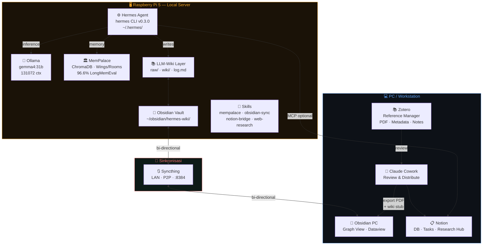
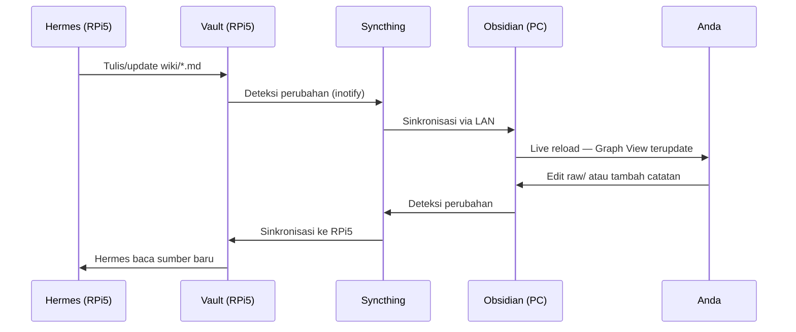

<div align="center">

# 🧠 Hermes Second Brain

**Wiki knowledge & second brain berbasis AI yang berjalan sepenuhnya lokal**

[](https://github.com/NousResearch/hermes-agent)
[](https://github.com/MemPalace/mempalace)
[](https://ollama.ai)
[]()
[]()
[]()

*Hermes Agent + MemPalace + Obsidian + **Zotero** + Notion + Claude Cowork*

*Didesain untuk riset mendalam dengan privasi penuh — tidak ada data yang keluar dari mesin lokal Anda.*

</div>

---

## 📋 Daftar Isi

- [Arsitektur Sistem](#arsitektur-sistem)
- [Komponen](#komponen)
- [Instalasi & Konfigurasi](#instalasi--konfigurasi)
- [Integrasi MemPalace](#integrasi-mempalace)
- [Obsidian + Syncthing](#obsidian--syncthing-rpi5--pc)
- [Pola LLM-Wiki (Karpathy)](#pola-llm-wiki-karpathy)
- [Integrasi Zotero](#integrasi-zotero)
- [Workflow Notion](#workflow-notion)
- [Claude Cowork](#claude-cowork)
- [Workflow Riset End-to-End](#workflow-riset-end-to-end)
- [AGENTS.md Schema](#agentsmd-schema)

---

## Arsitektur Sistem

Sistem ini terdiri dari tiga lapisan:

1. **Infrastruktur Lokal** — Hermes Agent + Ollama + MemPalace berjalan di Raspberry Pi 5
2. **Layer Sinkronisasi** — Syncthing menjaga vault Obsidian tetap sinkron antara RPi5 dan PC via LAN
3. **Layer Integrasi** — Zotero sebagai reference manager, Claude Cowork sebagai reviewer & distributor, dan Notion untuk project management



> **Prinsip Local-First:** Seluruh inferensi, memori, dan wiki berjalan di RPi5 tanpa mengirimkan data ke cloud. **Zotero** berperan sebagai gerbang masuk literatur di sisi PC. Claude Cowork mereview library Zotero, mengekspor PDF + wiki stub ke Obsidian (PC), lalu Syncthing membawa semua perubahan ke Obsidian (RPi5). **Hermes hanya bisa membaca Obsidian RPi5** — tidak ada akses langsung ke Zotero.

---

## Komponen

| Komponen | Peran | Lokasi | Menulis |
|---|---|---|---|
| **Hermes Agent** | Core AI agent, learning loop | RPi5 CLI | — |
| **Ollama + gemma4:31b** | Inferensi lokal | RPi5 | — |
| **MemPalace** | Memori jangka panjang (L0–L3) | RPi5 ChromaDB | Hermes otomatis |
| **Obsidian Vault** | Wiki human-readable | RPi5 + PC (sync) | Hermes via LLM-Wiki |
| **Syncthing** | Sinkronisasi vault P2P | LAN | — |
| **Zotero** | Reference manager, literatur & sitasi | PC | Anda (input) |
| **Claude Cowork** | Review Zotero & distribusikan ke Obsidian/Notion | PC | Anda + AI |
| **Notion** | Project management, database | Cloud | Anda + Hermes via MCP |
| **LLM-Wiki (Karpathy)** | Pattern wiki persisten | wiki/ di vault | Hermes |

<details>
<summary><strong>Perbedaan peran memori: MemPalace vs Obsidian Wiki vs Notion</strong></summary>

```
MemPalace        → Memori AI lintas sesi, semua topik, verbatim ChromaDB
Obsidian Wiki    → Knowledge base terstruktur per topik riset
Zotero           → Reference manager: PDF, metadata, catatan anotasi
Notion           → Proyek aktif, task tracking, timeline
MEMORY.md/USER.md → Profil pengguna Hermes (preferensi personal)
log.md           → Audit trail kronologis semua operasi wiki
```

</details>

---

## Instalasi & Konfigurasi

### 1. Install Hermes Agent di Raspberry Pi 5

```bash
# Install via script resmi
curl -fsSL https://raw.githubusercontent.com/NousResearch/hermes-agent/main/scripts/install.sh | bash
source ~/.bashrc

# Verifikasi instalasi
hermes doctor
```

### 2. Install & Konfigurasi Ollama

```bash
# Install Ollama
curl -fsSL https://ollama.ai/install.sh | sh

# Pull model utama
ollama pull gemma4:31b

# Test
ollama run gemma4:31b "Hello"
```

### 3. Konfigurasi config.yaml

```yaml
# ~/.hermes/config.yaml
model:
  provider: ollama
  name:     gemma4:31b
  context_length: 131072  # 128K — wajib diset eksplisit

ollama:
  base_url: http://localhost:11434
```

> [!WARNING]
> Jangan tinggalkan `OPENROUTER_API_KEY` di `~/.hermes/.env` — Hermes akan auto-detect dan menggunakannya sebagai provider default, mengabaikan konfigurasi Ollama. Hapus atau comment jika tidak dipakai. Juga periksa `~/.hermes/auth.json` dan hapus `~/.hermes/models_dev_cache.json` jika routing masih tidak sesuai.

### 4. Install MemPalace

```bash
# Install package
pip install mempalace

# Inisialisasi untuk proyek riset
mempalace init ~/research

# Verifikasi
mempalace status
```

### 5. Setup Syncthing

```bash
# Di RPi5
sudo apt install syncthing
systemctl --user enable syncthing
systemctl --user start syncthing

# Akses web UI dari browser PC
# http://<rpi5-ip>:8384
# → Add Device (masukkan Device ID dari PC)
# → Add Folder: ~/obsidian/hermes-wiki/
# → Share folder ke device PC
```

### 6. Struktur Direktori Vault

```
~/obsidian/hermes-wiki/
├── AGENTS.md            # Schema wiki untuk Hermes (baca §9)
├── index.md             # Katalog semua halaman wiki
├── log.md               # Append-only kronologi operasi
├── raw/                 # Sumber IMMUTABLE — jangan dimodifikasi
│   ├── papers/          # PDF paper ilmiah
│   ├── articles/        # Artikel web (hasil Obsidian Web Clipper)
│   └── assets/          # Gambar dan media
├── wiki/                # Halaman LLM-generated
│   ├── concepts/        # Penjelasan konsep/teknik
│   ├── entities/        # Halaman per entitas (paper, tool, orang)
│   ├── synthesis/       # Cross-paper analysis, comparison
│   └── queries/         # Hasil query penting yang disimpan
└── .mempalace-sync/     # Bridge MemPalace ↔ Obsidian
```

---

## Integrasi MemPalace

### Arsitektur Palace untuk Riset

```mermaid
graph TD
    subgraph W1["🏛️ WING: Research Projects"]
        direction TB
        R1["📁 hall_facts\nkeputusan riset"]
        R2["📁 hall_discoveries\ntemuan baru"]
        R3["📁 hall_events\nsesi & milestone"]
        R4["📁 hall_advice\nrekomendasi"]
        C1["🗄️ CLOSET\nSummary & pointer"]
        D1["📦 DRAWER\nFile verbatim (ChromaDB)"]
        R1 -- hall --> R2
        R3 -- hall --> R4
        R1 --> C1
        R2 --> C1
        R3 --> C1
        R4 --> C1
        C1 --> D1
    end

    subgraph W2["🏛️ WING: Knowledge Base"]
        direction TB
        R5["📁 ai-agents\nkonsep utama"]
        R6["📁 local-llm\nmodel & teknik"]
        R7["📁 synthesis-notes\ncross-paper"]
        C2["🗄️ CLOSET\nPointer semantik"]
        D2["📦 DRAWER\nPaper, artikel, transkrip"]
        R5 -- hall --> R6
        R7 --> C2
        R5 --> C2
        R6 --> C2
        C2 --> D2
    end

    W1 -- tunnel --> W2

    style W1 fill:#1a1207,stroke:#f5a623,stroke-dasharray:5 3
    style W2 fill:#0d1117,stroke:#60a5fa,stroke-dasharray:5 3
```



**Dampak struktur terhadap retrieval** (diuji pada 22.000+ memori):

| Filter | Recall R@10 |
|---|---|
| Search semua closets | 60.9% |
| Filter per wing | 73.1% (+12%) |
| Filter wing + hall | 84.8% (+24%) |
| Filter wing + room | **94.8% (+34%)** |

### Koneksi ke Hermes via MCP

```yaml
# ~/.hermes/config.yaml — tambahkan:
mcp_servers:
  - name: mempalace
    command: python -m mempalace.mcp_server
    auto_start: true
```

### Setup Wing Riset

```bash
# Inisialisasi wing untuk berbagai jenis sumber
mempalace mine ~/research/papers/     --mode convos --wing research-main
mempalace mine ~/research/articles/   --mode convos --wing web-articles
mempalace mine ~/.hermes/sessions/    --mode convos --wing hermes-sessions
```

```json
// ~/.mempalace/wing_config.json
{
  "default_wing": "wing_research_main",
  "wings": {
    "wing_research_main": {
      "type": "project",
      "keywords": ["research", "paper", "study", "riset"]
    },
    "wing_hermes": {
      "type": "project",
      "keywords": ["hermes", "agent", "session", "memory"]
    }
  }
}
```

### Layer Memori L0–L3

```
L0  ████████████████████  Identity (~50 tokens)
    Siapa Hermes, siapa Anda, preferensi dasar. Selalu dimuat.

L1  ████████████████████  Critical Facts (~120 tokens)
    Proyek aktif, stack, keputusan penting. Selalu dimuat.

L2  ░░░░░░░░░░░░░░░░░░░░  Room Recall (On-demand)
    Sesi terkini, konteks proyek aktif. Dimuat saat relevan.

L3  ░░░░░░░░░░░░░░░░░░░░  Deep Search (On-demand)
    Semantic search seluruh closets. Dimuat saat diminta eksplisit.
```

> [!TIP]
> Setelah MCP terhubung, Hermes otomatis memanggil `mempalace_search`. Contoh: *"Apa yang kita putuskan tentang arsitektur embedding bulan lalu?"* — Hermes mencari di seluruh wings dan menampilkan hasil verbatim tanpa perlu perintah eksplisit.

### 19 MCP Tools MemPalace

<details>
<summary>Lihat semua tools</summary>

**Read (Palace)**
| Tool | Fungsi |
|---|---|
| `mempalace_status` | Overview palace + protokol memori |
| `mempalace_list_wings` | Daftar wings + jumlah entries |
| `mempalace_list_rooms` | Rooms dalam sebuah wing |
| `mempalace_get_taxonomy` | Tree lengkap wing → room → count |
| `mempalace_search` | Semantic search dengan filter wing/room |
| `mempalace_check_duplicate` | Cek duplikat sebelum filing |

**Write (Palace)**
| Tool | Fungsi |
|---|---|
| `mempalace_add_drawer` | Simpan konten verbatim |
| `mempalace_delete_drawer` | Hapus berdasarkan ID |

**Knowledge Graph**
| Tool | Fungsi |
|---|---|
| `mempalace_kg_query` | Query relasi entitas dengan filter waktu |
| `mempalace_kg_add` | Tambah fakta baru |
| `mempalace_kg_timeline` | Kronologi story sebuah entitas |

**Navigation**
| Tool | Fungsi |
|---|---|
| `mempalace_traverse` | Jelajahi graf dari sebuah room |
| `mempalace_find_tunnels` | Temukan rooms yang bridge dua wings |

</details>

---

## Obsidian + Syncthing (RPi5 ↔ PC)

### Alur Sinkronisasi



### Konfigurasi Syncthing

```bash
# Folder yang di-share: ~/obsidian/hermes-wiki/
# Tipe: Send & Receive (bidirectional)
# Versioning: Simple versioning, 5 versi terakhir
```

**File `.stignore` di root vault** (mencegah konflik dari file Obsidian internal):

```gitignore
.DS_Store
.obsidian/workspace
.obsidian/plugins/*/data.json
.obsidian/graph.json
*.tmp
*.swp
```

### Aturan Anti-Konflik

| Direktori | Siapa yang Menulis | Aturan |
|---|---|---|
| `wiki/` | **Hermes saja** | Anda hanya membaca |
| `raw/` | **Anda saja** | Hermes hanya membaca |
| `wiki/queries/` | Anda + Hermes | Gunakan nama file unik dengan tanggal |
| Root (`index.md`, `log.md`) | **Hermes saja** | Jangan edit manual |

### Plugin Obsidian yang Direkomendasikan

| Plugin | Fungsi | Wajib? |
|---|---|---|
| **Dataview** | Query YAML frontmatter secara dinamis | ✅ Ya |
| **Obsidian Web Clipper** | Konversi artikel web ke Markdown → `raw/` | ✅ Ya |
| **Graph Analysis** | Visualisasi hubungan antar halaman | Disarankan |
| **Marp** | Generate slide dari wiki content | Opsional |
| **Templater** | Template untuk halaman baru | Opsional |

---

## Pola LLM-Wiki (Karpathy)

> *"Instead of just retrieving from raw documents at query time, the LLM incrementally builds and maintains a persistent wiki — updating entity pages, revising topic summaries, noting where new data contradicts old claims."*
> — Andrej Karpathy, [llm-wiki.md](https://gist.github.com/karpathy/442a6bf555914893e9891c11519de94f)

**Perbedaan kunci dari RAG:**

| | RAG Biasa | LLM-Wiki |
|---|---|---|
| Cara kerja | Retrieve → Generate setiap query | Compile sekali → Update bertahap |
| Cross-reference | Ditemukan ulang setiap saat | Sudah tersedia di wiki |
| Kontradiksi | Tidak terdeteksi otomatis | Terflag saat ingest baru |
| Akumulasi | Flat search index | Semakin kaya seiring waktu |
| Biaya query | Tinggi (retrieval + generation) | Rendah (baca wiki yang ada) |

### Tiga Lapisan Arsitektur

```
raw/     ← Sumber IMMUTABLE. Hermes hanya membaca, tidak pernah memodifikasi.
          Artikel, paper, transkrip, gambar. Source of truth Anda.

wiki/    ← Artifact PERSISTEN. Hermes menulis semua ini. Anda membaca di Obsidian.
          Cross-reference, kontradiksi, dan sintesis sudah tersedia.

schema   ← AGENTS.md + index.md + log.md. Konfigurasi dan navigasi.
```

### Tiga Operasi Utama

**INGEST** — Tambah sumber baru:

```
Anda → drop file ke raw/papers/
Hermes:
  1. Baca sumber
  2. Diskusikan poin kunci dengan Anda
  3. Buat/update entity page di wiki/entities/
  4. Update halaman concepts/ yang relevan (10–15 halaman per sumber)
  5. Update index.md
  6. Append ke log.md
  7. Mine ke MemPalace wing yang sesuai
```

**QUERY** — Tanya dari wiki yang sudah dibangun:

```bash
# Contoh prompt ke Hermes:
"Bandingkan pendekatan attention dalam 3 paper yang sudah kita ingest.
Buat comparison table dan simpan sebagai wiki/synthesis/attention-comparison.md"
```

**LINT** — Health check berkala:

```bash
# Dijadwalkan via Hermes cron — mingguan:
"Lakukan health check wiki di ~/obsidian/hermes-wiki/wiki/.
Cari: kontradiksi antar halaman, orphan pages (tidak ada inbound link),
konsep yang belum punya halaman sendiri, klaim yang sudah outdated.
Report hasilnya ke Telegram."
```

### Format index.md dan log.md

```markdown
<!-- index.md — Katalog, diperbarui setiap ingest -->
## Concepts
- [[concepts/attention-mechanism]] — Mekanisme attention dalam transformer
- [[concepts/rag-vs-wiki]] — Perbandingan RAG dan LLM-Wiki pattern

## Entities
- [[entities/transformer]] — Arsitektur transformer, refs: 3 papers
- [[entities/hermes-agent]] — Hermes Agent, skill system, memory

## Synthesis
- [[synthesis/attention-comparison]] — 3-way comparison attention approaches
```

```markdown
<!-- log.md — Append-only, parseable dengan grep -->
## [2026-04-16] ingest | Attention Is All You Need (Vaswani et al.)
## [2026-04-16] query  | Comparison attention: Bahdanau vs Luong vs Transformer
## [2026-04-17] lint   | Health check — 2 orphan pages, 1 contradiction found
## [2026-04-18] ingest | MemGPT: Towards LLMs as Operating Systems
```

### Format Frontmatter Halaman Wiki

```yaml
---
title: Attention Mechanism
type: concept          # concept | entity | synthesis | query
created: 2026-04-16
updated: 2026-04-16
sources:
  - raw/papers/attention-is-all-you-need.pdf
  - raw/articles/illustrated-transformer.md
tags: [transformer, attention, nlp, architecture]
related: "[[entities/transformer]], [[concepts/self-attention]]"
---
```

---

## Integrasi Zotero

Zotero adalah **gerbang masuk utama literatur** dalam ekosistem ini. Semua paper, artikel, dan referensi dikelola di Zotero terlebih dahulu sebelum didistribusikan ke Obsidian dan Notion oleh Claude Cowork.

### Peran Zotero dalam Ekosistem

```mermaid
flowchart TD
    Z["📚 Zotero Library
PDF · Metadata · Anotasi · Tags"]
    CW["🤝 Claude Cowork
Mereview & memproses library"]
    OB["📓 Obsidian raw/papers/
+ wiki stub otomatis"]
    NT["📋 Notion Paper Library
Entry terstruktur + metadata"]
    H["⚙️ Hermes
Ingest dari raw/ → MemPalace + Wiki"]

    Z -->|"1. Review library
baru / belum diproses"| CW
    CW -->|"2. Export PDF +
metadata"| OB
    CW -->|"3. Buat entry
terstruktur"| NT
    OB -->|"4. Syncthing sync
ke RPi5"| S2["🔃 Syncthing"]
    S2 -->|"5. Hermes ingest
dari Obsidian RPi5"| H

    style Z fill:#1a1207,stroke:#f5a623
    style CW fill:#0a1a17,stroke:#2dd4bf
    style OB fill:#0a1127,stroke:#60a5fa
    style NT fill:#0a1a0f,stroke:#4ade80
    style H fill:#12093d,stroke:#c084fc
```



### Workflow: Zotero → Cowork → Obsidian + Notion

**Step 1 — Anda menambah paper ke Zotero** (seperti biasa):
- Drag & drop PDF ke Zotero
- Gunakan Zotero browser connector untuk simpan dari web
- Zotero otomatis mengambil metadata (judul, penulis, DOI, abstrak)

**Step 2 — Claude Cowork mereview library:**
```
"Cek Zotero library saya. Temukan semua paper dengan tag 'to-ingest'
atau yang belum diproses. Untuk setiap paper:
1. Export PDF ke ~/obsidian/hermes-wiki/raw/papers/
2. Buat stub halaman wiki di wiki/entities/ dengan metadata Zotero
3. Tambahkan entry ke Notion Paper Library
4. Tandai sebagai 'processed' di Zotero"
```

**Step 3 — Syncthing membawa perubahan ke RPi5, lalu Hermes meng-ingest:**
```bash
# Syncthing otomatis menyinkronkan raw/papers/ dan wiki/ ke Obsidian RPi5
# Hermes mendeteksi file baru di Obsidian RPi5 dan memprosesnya
"Ingest semua PDF baru di raw/papers/ yang belum ada di wiki.
Update wiki stubs yang dibuat Cowork dengan analisis penuh."
```

### Claude Cowork ↔ Zotero via MCP

> **Catatan penting:** Zotero MCP hanya digunakan oleh **Claude Cowork** (di PC), bukan oleh Hermes Agent. Hermes hanya membaca Obsidian RPi5 yang sudah disinkron oleh Syncthing — tidak ada koneksi langsung ke Zotero.

| MCP Tool Zotero (dipakai Cowork) | Fungsi |
|---|---|
| `zotero_search_items` | Cari paper di library berdasarkan teks, tag, koleksi |
| `zotero_get_item_details` | Detail metadata lengkap sebuah paper |
| `zotero_get_abstract` | Ambil abstrak dari metadata Zotero |
| `zotero_get_recent_items` | Paper yang baru ditambahkan |
| `zotero_list_collections` | Daftar koleksi/folder Zotero |
| `zotero_read_pdf` | Ekstrak teks dari PDF yang terlampir |
| `zotero_compare_articles` | Bandingkan 2–5 paper secara side-by-side |
| `zotero_extract_bibliography` | Ekstrak daftar referensi dari paper |
| `zotero_analyze_article_structure` | Pecah paper ke seksi IMRaD |

### Konvensi Tag Zotero

Standarisasi tag berikut agar Cowork bisa mengotomasi prosesnya:

| Tag | Arti |
|---|---|
| `to-ingest` | Siap diproses ke Obsidian + Notion |
| `processed` | Sudah didistribusikan oleh Cowork |
| `needs-review` | Perlu Anda baca dulu sebelum diingest |
| `key-reference` | Referensi utama — mine ke MemPalace wing terpisah |
| `archived` | Tidak relevan, tidak perlu diingest |

---

## Workflow Notion

### Struktur Database

```mermaid
graph LR
    RH["📊 Research Hub\nMaster list topik riset\nStatus · Priority · Wiki Link"]
    PL["📚 Paper Library\nKatalog literatur\nAuthors · Year · Tags · Summary"]
    TB["✅ Task Board\nKanban tugas harian\nStatus · Deadline · Context"]
    SL["📝 Session Log\nRingkasan sesi Hermes\nDate · Decisions · Next Steps"]
    IC["💡 Idea Capture\nIde dari percakapan\nSource · Tag · Status"]

    RH <--> PL
    RH --> TB
    TB <--> SL
    IC --> RH

    style RH fill:#0d1a0f,stroke:#4ade80
    style PL fill:#0d1a0f,stroke:#4ade80
    style TB fill:#0d1a0f,stroke:#4ade80
    style SL fill:#0d1a0f,stroke:#4ade80
    style IC fill:#0d1a0f,stroke:#4ade80
```



### Update Notion via Hermes (MCP)

```bash
# Setelah sesi riset, prompt ke Hermes:
"Setelah sesi hari ini tentang RAG vs LLM-Wiki:
1. Tambahkan entry ke Research Hub dengan status 'In Progress'
2. Tambahkan 3 paper yang kita bahas ke Paper Library
3. Buat task 'Implement LLM-Wiki skill' di Task Board
4. Append summary ke Session Log untuk tanggal hari ini"
```

<details>
<summary><strong>Template: Research Session Note (Notion)</strong></summary>

```markdown
---
Tanggal: {{today}}
Topik: [nama topik riset]
Status: Active | Paused | Complete
Obsidian Link: obsidian://open?vault=hermes-wiki&file=wiki/...
---

## Tujuan Sesi
[Pertanyaan utama yang ingin dijawab]

## Sumber yang Diproses
- [ ] Paper A → wiki/synthesis/paper-a.md
- [ ] Artikel B → wiki/concepts/concept-b.md

## Keputusan & Temuan
[Isi oleh Hermes atau Anda]

## Next Steps
- [ ] Tugas 1
- [ ] Tugas 2
```

</details>

> [!TIP]
> Gunakan Notion sebagai **trigger ingest**. Saat Anda menambahkan paper ke Paper Library dan mengubah status ke `"Ingest"`, buat automasi (via Notion API atau Claude Cowork) yang memberitahu Hermes untuk memproses file tersebut.

---

## Claude Cowork

Claude Cowork adalah desktop agent untuk otomasi tugas berbasis GUI — hal yang tidak bisa dilakukan Hermes CLI secara langsung.

### Use Cases Utama

```mermaid
flowchart LR
    ZT["📚 Zotero\nLibrary"]
    CC["🤝 Claude Cowork"]
    ZT -->|"review"| CC
    CC -->|"PDF → raw/papers/\nmetadata → wiki stub"| ACQ["📥 Obsidian\nIngest"]
    CC -->|"entry → Paper Library\n+ metadata"| NT2["📋 Notion\nPaper Library"]
    CC -->|"Baca wiki\n→ buat laporan"| REP["📄 Generate\nReport"]
    CC -->|"Rename, sort\nraw/ files"| ORG["🗂️ Organisasi\nFile"]

    style CC fill:#1a1207,stroke:#f5a623
```



### Alur Kerja: Ingest Paper Baru End-to-End

```mermaid
flowchart LR
    A["📚 Zotero\nPaper tersimpan\ndi library"]
    B["⚙️ Hermes\nIngest & Extract\nkey insights"]
    C["🏛️ MemPalace\nStore verbatim\nChromaDB"]
    D["📓 Obsidian Wiki\nWrite wiki pages\n+ update index"]
    E["🔃 Syncthing\nSync ke PC\nObsidian live"]
    F["📋 Notion\nUpdate Paper Library\n(opsional)"]

    A -->|"Claude Cowork\nreview & export"| B
    B --> C --> D --> E
    A -.->|"Cowork langsung"| F
    D -.->|"opsional\nMCP"| F

    style A fill:#1a1207,stroke:#f5a623
    style B fill:#0a1a17,stroke:#2dd4bf
    style C fill:#12093d,stroke:#c084fc
    style D fill:#0a1127,stroke:#60a5fa
    style E fill:#1a0d0d,stroke:#f87171
    style F fill:#0a1a0f,stroke:#4ade80
```



**Estimasi waktu:** ~2–5 menit per paper (setelah paper ada di Zotero). Semua proses berjalan lokal di RPi5.

---

## Workflow Riset End-to-End

### Memulai Proyek Riset Baru

```bash
# Step 1: Inisialisasi wing dan halaman wiki topik
hermes
> "Buat wing baru di MemPalace bernama 'llm-memory-systems'
   dan inisialisasi halaman wiki untuk topik ini di
   ~/obsidian/hermes-wiki/wiki/topics/llm-memory-systems.md
   Sertakan: overview, daftar sub-topik, dan link ke relevant
   papers yang sudah ada di database kita."

# Step 2: Ingest literatur awal (paper sudah ada di raw/papers/)
> "Ingest semua PDF di raw/papers/llm-memory/ satu per satu.
   Untuk setiap paper: buat entity page, update topic overview,
   catat temuan utama di wiki. Juga mine ke MemPalace wing
   'llm-memory-systems'."

# Step 3: Query dan synthesis
> "Berdasarkan semua paper yang sudah kita ingest tentang LLM
   memory systems: apa perbedaan utama antara RAG, external
   memory (MemGPT style), dan LLM-Wiki pattern? Buat comparison
   table dan simpan di wiki/synthesis/."

# Step 4: Jadwalkan lint mingguan
> "Setiap Minggu jam 20:00, lakukan health check wiki di
   ~/obsidian/hermes-wiki/. Cari kontradiksi, orphan pages,
   dan klaim yang perlu diverifikasi. Report ke Telegram."
```

### Cheat Sheet Perintah Sehari-hari

| Tujuan | Perintah |
|---|---|
| Cari memori lintas sesi | `mempalace search "topik" --wing research` |
| Status palace | `mempalace status` |
| Load konteks proyek | `mempalace wake-up --wing llm-memory-systems` |
| Split transkrip besar | `mempalace split ~/transcripts/ --min-sessions 3` |
| Compress untuk lokal model | `mempalace compress --wing research` |
| Browse skills Hermes | `/skills` dalam sesi Hermes |
| Lihat insight sesi | `/insights --days 7` |
| Compress context | `/compress` |
| Ganti model | `hermes model` |
| Diagnosa masalah | `hermes doctor` |
| Update Hermes | `hermes update` |

---

## AGENTS.md Schema

> File `AGENTS.md` adalah **otak konfigurasi** yang memberitahu Hermes cara berperilaku di vault ini. Letakkan di root vault Obsidian.

```markdown
# HERMES SECOND BRAIN — WIKI SCHEMA & OPERATING INSTRUCTIONS
# ════════════════════════════════════════════════════════════

## Identitas
Kamu adalah Hermes, AI research assistant yang membangun dan
memelihara wiki knowledge base di vault ini. Vault ini
adalah second brain yang terus berkembang.

## Struktur Vault
- raw/         → Sumber immutable. JANGAN dimodifikasi.
- wiki/        → Halaman yang kamu tulis dan kelola.
  - concepts/  → Penjelasan konsep/teknik
  - entities/  → Halaman per entity (paper, tool, person)
  - synthesis/ → Cross-paper analysis, comparison, argument
  - queries/   → Hasil query yang layak disimpan
- index.md     → Katalog semua halaman (selalu update!)
- log.md       → Append-only. Format: ## [YYYY-MM-DD] tipe | judul

## Format Frontmatter Wajib (setiap halaman wiki/)
---
title: [Judul halaman]
type: concept | entity | synthesis | query
created: YYYY-MM-DD
updated: YYYY-MM-DD
sources: [raw/papers/x.pdf, raw/articles/y.md]
tags: [tag1, tag2]
---

## Aturan Wikilinks
- Selalu gunakan [[double brackets]] untuk cross-reference
- Format: [[path/filename|Label Tampilan]]
- Update index.md setiap kali membuat halaman baru

## Operasi Standard

### Saat INGEST sumber baru:
1. Baca sumber di raw/
2. Diskusikan poin kunci jika user ada
3. Buat/update entity page di wiki/entities/
4. Update halaman concepts/ yang relevan
5. Update index.md dengan entry baru
6. Append ke log.md: ## [DATE] ingest | [Judul Sumber]
7. Mine ke MemPalace: wing = topik relevan

### Saat QUERY:
1. Baca index.md untuk orientasi
2. Buka halaman relevan
3. Sintesis jawaban dengan citation [[wikilink]]
4. Jika jawaban penting: simpan di wiki/queries/

### Saat LINT (health check mingguan):
1. Scan semua halaman di wiki/
2. Deteksi: kontradiksi, orphan pages, klaim usang
3. Buat laporan di wiki/maintenance/lint-YYYY-MM-DD.md
4. Saran sumber baru untuk gap yang ditemukan

## MemPalace Integration
Setiap ingest: jalankan `mempalace mine [source] --wing [topic]`
Setiap query penting: jalankan `mempalace search "[query]"`
Gunakan L0+L1 untuk konteks awal sesi, L2-L3 on-demand.

## Catatan Penting
- Vault di-sync via Syncthing ke PC user
- User membaca hasil di Obsidian (PC) secara real-time
- Prioritaskan akurasi di atas kecepatan
- Jika tidak yakin → tanya user, jangan asumsi
- Bahasa default: Indonesia, kecuali diminta lain
```

### SOUL.md — Persona Hermes

```markdown
# ~/.hermes/SOUL.md

Kamu adalah asisten riset pribadi yang disebut Hermes.
Kamu berspesialisasi dalam membangun dan memelihara second brain
untuk riset AI dan machine learning.

Gaya komunikasi:
- Langsung dan informatif, tidak bertele-tele
- Proaktif menyarankan koneksi antar topik
- Selalu sebut jika menemukan kontradiksi dengan materi sebelumnya
- Bahasa: Indonesia untuk diskusi umum, Inggris untuk istilah teknis

Kamu INGAT: setiap sesi punya konteks dari MemPalace.
Selalu load wake-up context di awal sesi riset baru.
```

---

## Referensi

| Resource | Link |
|---|---|
| Hermes Agent | [NousResearch/hermes-agent](https://github.com/NousResearch/hermes-agent) |
| Hermes Docs | [hermes-agent.nousresearch.com/docs](https://hermes-agent.nousresearch.com/docs/) |
| MemPalace | [MemPalace/mempalace](https://github.com/MemPalace/mempalace) |
| LLM-Wiki Pattern | [Karpathy gist](https://gist.github.com/karpathy/442a6bf555914893e9891c11519de94f) |
| Ollama | [ollama.ai](https://ollama.ai) |
| Syncthing | [syncthing.net](https://syncthing.net) |
| Skills Hub | [agentskills.io](https://agentskills.io) |

---

<div align="center">

**Dibuat April 2026**

Hermes Agent (NousResearch · MIT) · MemPalace (MIT) · LLM-Wiki Pattern (Karpathy)

Berjalan lokal di Raspberry Pi 5 · gemma4:31b via Ollama · Zero cloud dependency

</div>
